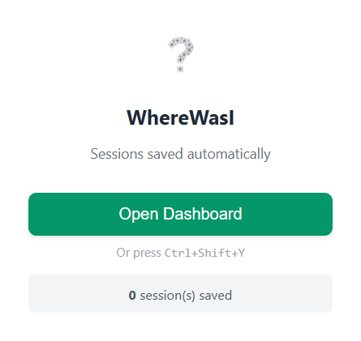
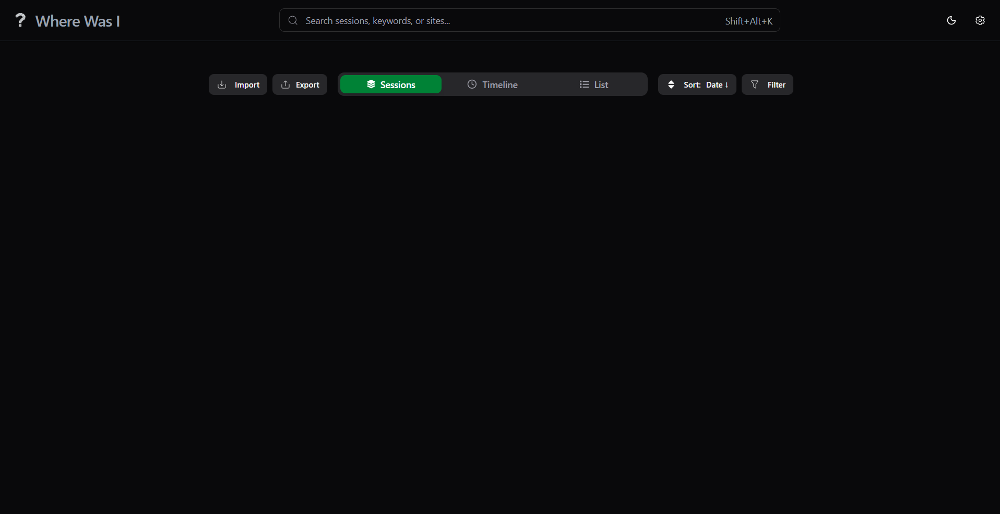
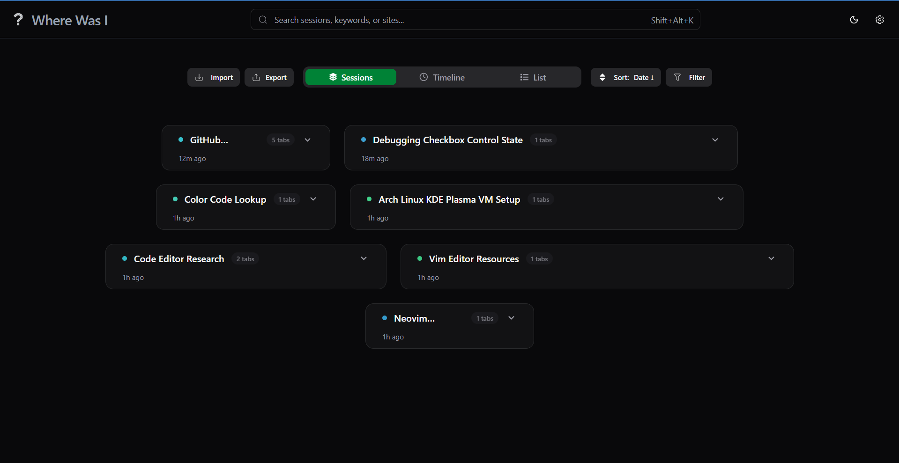
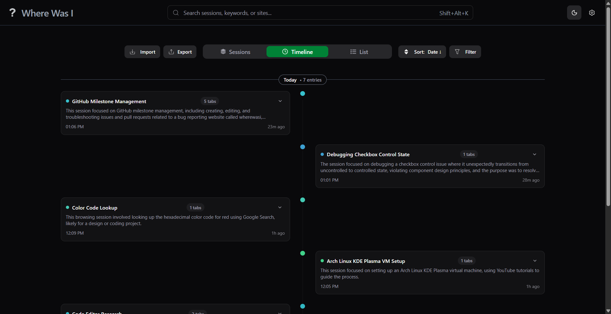
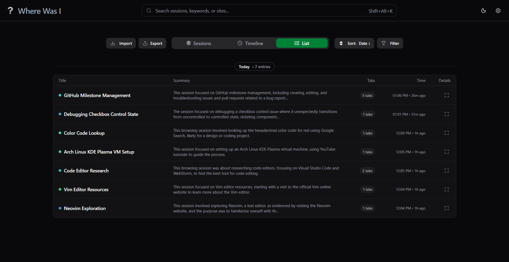
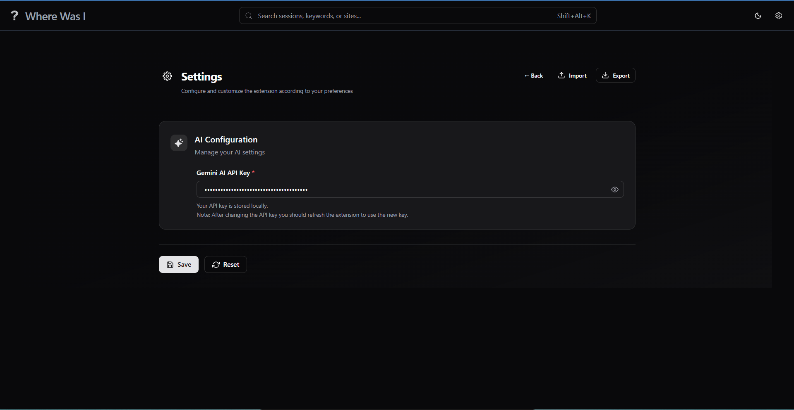
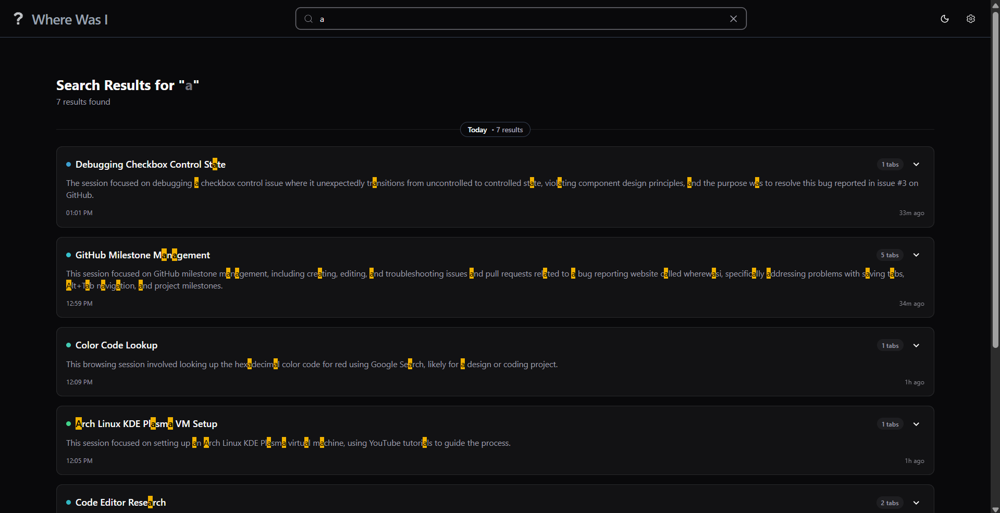

<div align="center" style="margin-top: 30px">
    
    <h1 style="margin-top: 12px;">Where Was I</h1>
    <p>
        A Chrome extension that remembers your sessions by capturing tabs, grouping<br/> them into sessions, with AI-powered summaries.
    </p>

  
  


</div>

---

## Key features

- Automatic capture of closed tabs (title, URL, favicon, timestamps)
- Auto grouping into sessions
- AI-generated session summaries
- Search and filters
- Move tabs across sessions using drag and drop
- Sessions sorting
- Export/Import to JSON

---

## Installation

**Requirements:**

- Chrome browser (version 137 or later)
- Read the hardware requirements [here](https://developer.chrome.com/docs/ai/get-started#hardware) which needs to be satisfied for AI Summaries.
- Gemini API Key (for tabs grouping, and title generation).

### Chrome Web Store

Install directly from web store:
https://chromewebstore.google.com/detail/where-was-i/adodkeanphfjocipdfkpnmpmjaoggfnf

### Manual

1. Clone the repository

```sh
git clone https://github.com/Jay-Karia/wherewasi
```

2. Install dependecies

```sh
npm install
cd dasboard && npm install
```

3. Build the extension by running the script based on your system (Windows/Unix)

```sh
# For Unix (Linux/Mac)
./scripts/build.sh

# For Windows (PowerShell)
./scripts/build.ps1
```

3. Open Chrome and navigate to `chrome://extensions/`
4. Enable "Developer mode" using the toggle in the top right corner.
5. Click on "Load unpacked" and select the `build` folder from the cloned repository.

## Setup

1. After installing the extension, click on the extension icon in the toolbar and open dashboard.
2. Go to the settings page by clicking on the gear icon.
3. Enter your Gemini API key in the provided field.

## Gallery

<details>
  <summary>Show Images</summary>

_Extension popup_



_Dashboard_



_Sessions view_



_Timeline view_



_List view_



_Settings_



_Search results_



</details>

## Privacy Policy

Your privacy is important to us. "Where Was I" collects minimal data necessary to provide its functionality. No personal data is collected or transmitted to any servers; all data processing occurs locally within your browser.

Visit [Privacy Policy](https://jay-karia.github.io/wherewasi/docs/privacy.html) page for more details.
