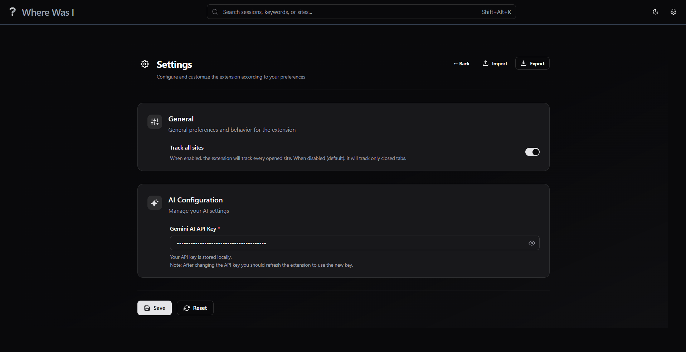

<div align="center" style="margin-top: 30px">
    
    <h1 style="margin-top: 12px;">Where Was I</h1>
    <p>
        A Chrome extension that remembers your sessions by capturing tabs, grouping<br/> them into sessions, with AI-powered summaries.
    </p>
</div>

---

## Key features

- Automatic capture of closed tabs (title, URL, favicon, timestamps)
- Auto grouping into sessions
- AI-generated session summaries
- Search and filters
- Move tabs across sessions using drag and drop
- Sessions sorting
- Export/Import to JSON

---

## Installation

**Requirements:**

- Chrome browser (version 137 or later)
- Read the hardware requirements [here](https://developer.chrome.com/docs/ai/get-started#hardware) which needs to be satisfied for AI Summaries.
- Gemini API Key (for tabs grouping, and title generation).

### Chrome Web Store

_Currently the extension is not uploaded to Web Store_

### Manual

1. Clone the repository

```sh
git clone https://github.com/Jay-Karia/wherewasi
```

2. Build the extension by running the script based on your system (Windows/Unix)

```sh
# For Unix (Linux/Mac)
./scripts/build.sh

# For Windows (PowerShell)
./scripts/build.ps1
```

3. Open Chrome and navigate to `chrome://extensions/`
4. Enable "Developer mode" using the toggle in the top right corner.
5. Click on "Load unpacked" and select the `build` folder from the cloned repository.

## Setup

1. After installing the extension, click on the extension icon in the toolbar and open dashboard.
2. Go to the settings page by clicking on the gear icon.
3. Enter your Gemini API key in the provided field.

## Gallery

<details>
  <summary>Show Images</summary>


_Extension popup_


_Dashboard — dark theme_


_Sessions view — dark theme_


_Timeline — dark theme_



_Settings — dark theme_


_Search results — dark theme_

</details>

## Roadmap

**v0.1.0**

- [x] Improve the content provided</div> to AI while grouping sessions.
- [x] Add summaries from Summarizer API
- [x] Error handling AI fails.
- [x] Get the API key from user.
- [x] Fix critical bugs listed in issues.

**v1.0.0**

- [ ] Merge Sessions
- [ ] Tabs caching
- [ ] Ignore injecting scripts to same window when refreshed
- [ ] Browser processing queue.
- [ ] Improve dashboard search with fuzzy finding.

<br>

**🚀 Coming Soon**
